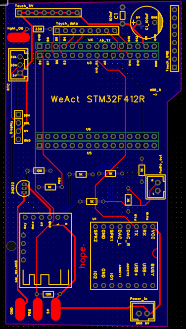
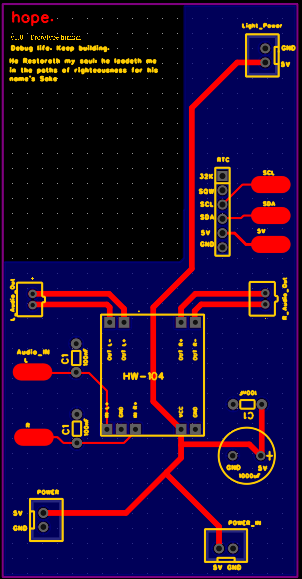

# HOPE: Advanced Embedded Baby Lullaby System

**HOPE** is a real-time embedded system designed to provide a soothing, customizable, and reliable sleep environment for infants. Built on the STM32F4 series microcontroller and FreeRTOS, this project demonstrates a strict, scalable layered architecture, utilizing advanced hardware features like Direct Memory Access (DMA) to achieve smooth UI rendering and uninterrupted multi-threaded performance.

---

## Key Features

*   **Dual-Source Audio Engine:** Seamlessly switch between local storage (DFPlayer Mini via UART) for built-in lullabies and streaming audio (MH-MX8 Bluetooth via isolated hardware toggling).
*   **Zero-Latency Touch Interface:** 8-channel capacitive touch input (TTP223) routed through EXTI hardware interrupts and RTOS queues for instant, debounce-free responsiveness.
*   **High-Speed OLED Display:** 1.5-inch 128x128 monochrome OLED. Utilizes a custom 2KB RAM framebuffer and non-blocking I2C DMA transfers (synchronized via FreeRTOS binary semaphores) to ensure 0% CPU blocking during screen updates.
*   **Ambient LED Animations:** WS2812B LED ring driven by a dedicated Hardware Timer (PWM) and DMA, offloading all timing constraints from the CPU while rendering smooth, breathing animations.
*   **Environmental Monitoring:** Temperature and humidity from a DHT22, read every 5 s with a hardware timer input-capture driver.
*   **Persistent RTC & Alarms:** External DS3231 I2C Real-Time Clock keeps time across power cycles; up to 10 alarms are saved in the module's AT24C32 EEPROM so they survive unplugging.

---

## ⚡ Hardware Overview

The physical system is split into an isolated power delivery board and a main logic controller to reduce audio interference and optimize power distribution. 

*   **Microcontroller:** STM32F412RET6 (ARM Cortex-M4) (WEACT board)
*   **Inputs:** 8x TTP223 ICs mapped to independent EXTI lines (No collisions).
*   **Display:** SH1107 1.5" I2C OLED (PB6/PB7).
*   **Audio Storage:** DFPlayer Mini (USART1 RX/TX: PA9/PA10).
*   **Bluetooth:** MH-MX8 module controlled via transistor switch (PB9).
*   **Lighting:** WS2812B data line mapped to TIM1_CH1 (PA8) for hardware PWM.
*   **Environment sensing:** A DHT22 module controlled via single wire data transfer for Temp and Humidity data.
*   **Time:**DS3231 RTC module used to keep persistent time even if power is removed. 
*   **Audio Output: PAM8403 digital amplifier for 2 * 3W speakers

### 🔌 Circuit Diagrams & PCBA

Here is the wiring for the project:




*The main PCB houses most systems including the STM32, DFPlayer, and BLE module. The power PCB utilizes a star power distribution layout, housing the RTC, amplifier, and speaker connections.*

---

### 💾 SD Card Layout (DFPlayer)

Tracks are played **by file name** (DFPlayer command `0x12`), so the order in which files were copied doesn't matter. Format the card FAT32 and use exactly this layout:

```text
SD card root
└── MP3/
    ├── 0001.mp3   Twinkle Twinkle
    ├── 0002.mp3   Amazing Grace
    ├── ...        (one file per entry in song_list[], ui_renderer.c)
    ├── 0025.mp3   Summertime
    └── 0026.mp3   Alarm tone (ALARM_TONE in ui_task.c)
```

- The folder must be named `MP3` and the file names must be 4 digits (`0001`–`3000`). Most modules also accept text after the digits (e.g. `0001_twinkle.mp3`), but plain `0001.mp3` is the safest choice.
- A lullaby loops until you stop it, change it, or the sleep timer ends. The alarm tone loops until it's dismissed (or 60 s pass).

---

## 🧠 Software Architecture

The HOPE system strictly adheres to a three-tier layered architecture to separate hardware constraints from business logic, ensuring modularity and easy future upgrades.

### 1. The Layered Design
*   **Driver Layer (`/Drivers`):** Direct HAL interactions. Includes the custom `sh1107` OLED framebuffer driver, the DFPlayer UART driver, DHT22 driver, DS3231 RTC driver and the Bluetooth GPIO power driver. 
*   **Service Layer (`/Services` & `/UI`):** Hardware-agnostic abstractions. Contains `ui_renderer.c` (which translates UI states into geometry) and `music_service.c` (which translates application commands into UART hex frames), Alarm service for the alarm system, Light service for the WS2812B control, Sensor service for the DHT22 sensor data, Time service to deal with data incoming from the DS3231 rtc module.
*   **Application Layer (`/Application`):** The FreeRTOS task logic and system state machines.

### 2. RTOS Task & Communication Strategy
The system is built on **FreeRTOS** and avoids global variable polling entirely. It operates on an event-driven messaging system using fixed-size deterministic structs (`ui_msg_t`).

*   **`UI Task` (The Core Brain):** The single source of truth. It blocks on a message queue awaiting hardware events (touch presses, sensor readings) or a 100ms heartbeat timeout. It manages the `ui_state_t` state machine and triggers the non-blocking DMA display renderer.
*   **`Music Task`:** An execution task that listens on `musicQueueHandle`. It safely manages hardware transitions between the DFPlayer and Bluetooth module to prevent audio collisions and save power.
*   **`Light Task`:** Manages the algorithmic generation of WS2812B frame data.

### 3. Concurrency & DMA Synchronization
To prevent the 400kHz I2C bus from choking the 100MHz CPU during screen updates, the display driver utilizes **Direct Memory Access (DMA)**.
1. The `UI Task` updates the 2KB RAM framebuffer and triggers the DMA hardware.
2. The `UI Task` attempts to take a semaphore and goes to sleep, yielding the CPU to the `Music` and `Light` tasks.
3. Upon DMA completion, the `HAL_I2C_MemTxCpltCallback` hardware interrupt gives the semaphore back, instantly waking the `UI Task` to send the next page of memory.

### 4. Directory Structure 
```text
Hope_V1/
├── Core/
│   ├── Inc/                  # CubeMX headers (main.h, FreeRTOSConfig.h, ...)
│   └── Src/
│       ├── Applications/     # FreeRTOS tasks: ui_task.c, music_task.c, light_task.c
│       ├── Drivers/          # DFPlayer, DHT22, DS3231, AT24C32 EEPROM, WS2812, BLE power
│       ├── Services/         # alarm, time, music, light, sensor services
│       ├── UI/               # ui_state.h (state machine types), ui_renderer.c
│       └── main.c, freertos.c, stm32f4xx_it.c, ...   # CubeMX-generated
├── Drivers/OLED/             # ssd1306 library (I2C + DMA), used for the 128x128 OLED
└── docs/                     # Schematics, UI mockups, and datasheets
```

## 🤖 AI-Assisted Educational Workflow

The HOPE project represents a modern approach to embedded systems development, strategically leveraging Artificial Intelligence (LLMs) not as a simple code generator, but as an interactive mentor and educational guide. Using AI as a dedicated tutor significantly accelerated the development cycle while profoundly expanding the developer's foundational engineering skill set.

*   **Hardware & Electrical Engineering Mentorship:** The AI was utilized as a sounding board to decipher complex module pinouts and component datasheets. It served as an interactive educator for analog circuit principles, teaching the developer how to properly calculate and place passive components (resistors and capacitors) to smooth input voltages and effectively mix dual analog audio outputs.
*   **Toolchain & Workflow Mastery:** Through guided, interactive sessions, the AI helped bridge the gap in learning industry-standard engineering tools from scratch. This included mastering **EasyEDA** for professional schematic capture and PCB design, as well as navigating **STM32CubeMX** and **STM32CubeIDE** for initial clock tree setup, pinout mapping, and hardware configuration.
*   **Software Architecture:** AI acted as a senior architectural mentor to help establish strict FreeRTOS paradigms. Rather than generating the final logic, the AI was used to discuss the "why" behind concepts like DMA-Semaphore synchronization and to validate complex memory mapping strategies, ensuring a deep understanding of the underlying C code.

---

##  Acknowledgments & Credits

*   **OLED Display Driver:** The core `ssd1306` library utilized in this project was originally written by Olivier Van den Eede (4ilo) in 2016. Some refactoring was done and SPI support was added by Aleksander Alekseev (afiskon) in 2018. The original source can be found here: [afiskon/stm32-ssd1306](https://github.com/afiskon/stm32-ssd1306).